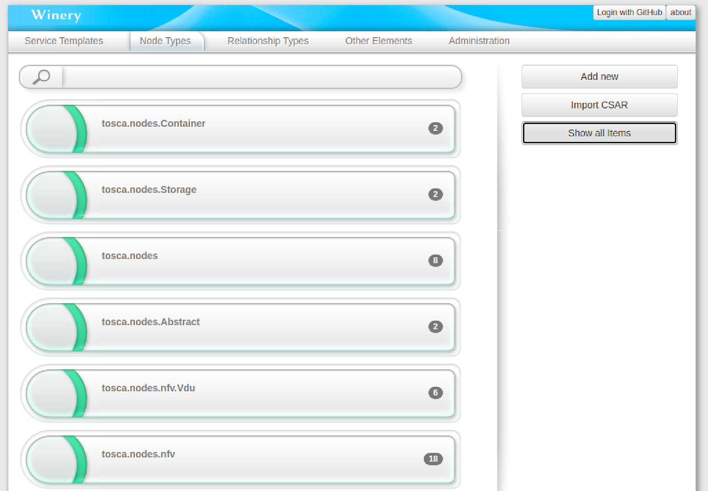

# Table of Contents
- [Table of Contents](#table-of-contents)
- [Disclaimer](#disclaimer)
- [Introduction](#introduction)
  - [What is TOSCA?](#what-is-tosca)
  - [TOSCA YAML Descriptors and TOSCA Service Archives (CSAR)](#tosca-yaml-descriptors-and-tosca-service-archives-csar)
  - [TOSCA Terminology](#tosca-terminology)
  - [Eclipse Winery](#eclipse-winery)
  - [What's the purpose of the *importToscaDescWinery* tool?](#whats-the-purpose-of-the-importtoscadescwinery-tool)
- [Installation of *importToscaDescWinery* Tool](#installation-of-importtoscadescwinery-tool)
- [How to load packages obtained by *importToscaDescWinery* into Eclipse Winery](#how-to-load-packages-obtained-by-importtoscadescwinery-into-eclipse-winery)
- [How to use *importToscaDescWinery* Tool](#how-to-use-importtoscadescwinery-tool)
  - [Command Syntax](#command-syntax)
  - [Content of the Template Directory](#content-of-the-template-directory)
  - [Handling of *.tosca* files in the Template Directory](#handling-of-tosca-files-in-the-template-directory)
  - [*LICENSE* and *README* files](#license-and-readme-files)
  - [Substitution of placeholders in the *README* files](#substitution-of-placeholders-in-the-readme-files)
  - [Example of handling of a sample input YAML file](#example-of-handling-of-a-sample-input-yaml-file)
  - [Content of the *appearance* subdirectory](#content-of-the-appearance-subdirectory)
  - [How to store artifacts in the *files* subdirectory](#how-to-store-artifacts-in-the-files-subdirectory)
- [Current Tool Limitations](#current-tool-limitations)
  - [YAML file validity](#yaml-file-validity)
  - [YAML file encoding](#yaml-file-encoding)
  - [Content of the YAML files](#content-of-the-yaml-files)
  - [*imports* clauses](#imports-clauses)
  - [Limitations in allowed YAML Service Templates](#limitations-in-allowed-yaml-service-templates)
- [Examples](#examples)
  - [OASIS TOSCA Normative Types](#oasis-tosca-normative-types)
  - [ETSI NFV SOL001 Types](#etsi-nfv-sol001-types)
  - [Examples Blueprints extracted and adapted from TOSCA Simple Profile in YAML v.1.3 (sec. 11)](#examples-blueprints-extracted-and-adapted-from-tosca-simple-profile-in-yaml-v13-sec-11)
    - [Compute Service Blueprint (sec. 11.1.2)](#compute-service-blueprint-sec-1112)
    - [Block Storage 1 Blueprint (sec. 11.1.4)](#block-storage-1-blueprint-sec-1114)
    - [2-Tier app with shared block storage (sec. 11.1.7)](#2-tier-app-with-shared-block-storage-sec-1117)
    - [Two servers bound to a single network (sec. 11.1.13)](#two-servers-bound-to-a-single-network-sec-11113)
    - [WebServer-DBMS 1: WordPress + MySQL, single instance (sec. 11.1.15)](#webserver-dbms-1-wordpress--mysql-single-instance-sec-11115)
- [Contributing to the *importToscaDescWinery* Tool](#contributing-to-the-importtoscadescwinery-tool)
- [Contacts](#contacts)
- [References](#references)

# Disclaimer
This software has been realized by [Engineering Ingegneria Informatica](https://www.eng.it/) and is licensed under the terms of the Apache License, Version 2.0 (the "License"); you may not use this file except in compliance with the License. You may obtain a copy of the License at:

> [http://www.apache.org/licenses/LICENSE-2.0](http://www.apache.org/licenses/LICENSE-2.0)

Unless required by applicable law or agreed to in writing, software distributed under the License is distributed on an "AS IS" BASIS, WITHOUT WARRANTIES OR CONDITIONS OF ANY KIND, either express or implied. See the License for the specific language governing permissions and limitations under the License.

# Introduction
This README file is also available in pdf format in the *./doc* subdirectory (click [here](./doc/README.pdf) to see and download it).

## What is TOSCA?
[TOSCA](https://www.oasis-open.org/committees/tc_home.php?wg_abbrev=tosca) (Topology and Orchestration Specification for Cloud Applications) is an [OASIS](https://www.oasis-open.org/) standard language aimed at describing cloud workloads, specifying their components, relationships, and the processes to manage them.

TOSCA provides portability and agnostic automation management across cloud providers regardless of the underlying platform or infrastructure. TOSCA models applications and services through Service Templates, which comprise:

  * a **Topology Template**, i.e. a graph of Node Templates modeling the application components as long as Relationship Templates, representing the relations between them;
  * one or more **Orchestration Plans**, which allow the definition of workflows that can be triggered on deployment/undeployment of a topology or during runtime, manually or automatically based on policies defined for the topology itself

## TOSCA YAML Descriptors and TOSCA Service Archives (CSAR)
A TOSCA Service Template is expressed by means of a TOSCA Descriptor in YAML format. It is worth observing that a YAML Descriptor may import definitions from other YAML Descriptors (e.g. a service may import definitions of node types, capability types, etc.). This has the following implications:

  * allows for reusability of definitions;
  * enables a modular approach to application and service specification.

OASIS itself, besides the definition of the TOSCA model and metalanguage, provides a set of basic types ([normative types](https://github.com/oasis-open/tosca-community-contributions/tree/master/profiles/org.oasis-open/simple)) that are expected to be well known by each TOSCA Compliant implementation. This means that each TOSCA Orchestration Engine (see below) should be able to manage in a well known way all normative node and relationship types, along with their respective capabilities, requirements, etc.

Similarly, ETSI NFV provides also a set of TOSCA definitions properly tailored for representing Virtual Network Functions (VNF), Physical Network Functions (PNF) and Network Services (NS) specifically designed for the Telecommunications environment ([ETSI NFV SOL0001](https://forge.etsi.org/rep/nfv/SOL001)).

Further, a TOSCA YAML Descriptor may also reference external files (artifacts) for specific purposes (e.g. a VM or a Container image to be used at application deployment, one or more scripts for implementing specific actions specified in orchestration workflows, descriptive or support files, such as licenses, etc.).

The TOSCA Standard defines also the concept of TOSCA Archive (or TOSCA Cloud Service Archive, CSAR for short). This is meant as a self-consistent package that contains all that is needed by a TOSCA Orchestration Engine for the whole application lifecycle time, from creation to termination. Basically, it is a compressed file with a predefined directory structure, which includes a TOSCA template of a Network Service, all the imported types and definitions, and all the artifacts (images, scripts, files, etc.) that are referenced within the YAML Service Template.

## TOSCA Terminology
The following definitions are taken directly from "[TOSCA Simple Profile in YAML Version 1.3](http://docs.oasis-open.org/tosca/TOSCA-Simple-Profile-YAML/v1.3/)":

  * **TOSCA YAML Service Template** (or “Service Template”): A YAML document artifact containing a (TOSCA) Topology Template that represents a Cloud application;
  * **TOSCA Processor** (or “Processor”): An engine or tool that is capable of parsing and interpreting a TOSCA service template for a particular purpose. For example, the purpose could be validation, translation or visual rendering;
  * **TOSCA Orchestrator** (also called Orchestration Engine): A TOSCA processor that interprets a TOSCA service template or a TOSCA CSAR in order to instantiate, deploy, and manage the described application in a Cloud;
  * **TOSCA Generator**: A tool that generates a TOSCA service template. An example of generator is a modeling tool capable of generating or editing a TOSCA Service Template (often such a tool would also be a TOSCA processor);
  * **TOSCA Archive** (or TOSCA Cloud Service Archive, or “CSAR”): a package artifact that contains a TOSCA Service Template and other artifacts usable by a TOSCA orchestrator to deploy an application.

## Eclipse Winery
[Eclipse Winery](https://winery.readthedocs.io/en/latest/) is an open source TOSCA Generator, specifically a Modeler, i.e. a tool that allows the user to design a TOSCA Service Template by means of a graphical editor, avoiding the burden to write YAML descriptors manually and to package them into a well formatted CSAR Archive.

Specifically, Winery consists of a web-based environment that includes a type and template management component to offer creation and modification of all elements defined in the TOSCA specification.

The figure below shows the appearance of the Node Types section of the Winery GUI:

By clicking on a Node Type, the GUI shows all details:

The same applies for all other types (e.g. Data Types, Artifact Types, Relationship Types, etc.).

All types defined in the tool are available in the canvas of the Winery Topology Modeler, that can be used to graphically represent and design Service Templates:

All information related to types managed and templates designed by Winery is stored in a repository, i.e. a folder on the local filesystem. Winery also allows importing and exporting service templates as TOSCA CSAR Archives. CSAR packages produced through Winery can be imported by a TOSCA Orchestrator to be deployed on a cloud infrastructure.

As already anticipated, Winery organizes all definitions, types and templates into a folder in the local filesystem. Upon the first installation, this folder is empty, i.e. the first time Winery is launched, it starts without any predefined type. There are several projects available on the web that provide some Winery repositories ready to use (see e.g. the [RADON project](https://radon-h2020.eu/), which provides the following [Winery Repository](https://github.com/radon-h2020/radon-particles)).

## What's the purpose of the *importToscaDescWinery* tool?
Given the above, it could be useful to have a tool able to parse a YAML descriptor and to extract information from it, organizing them into a folder structure directly usable by Winery. This is exactly the aim of the *importToscaDescWinery* tool described hereafter.

The *importToscaDescWinery* tool is a command line tool available under Linux, that allows to parse a TOSCA YAML descriptor (containing type definitions or alternatively a topology template) and to reorganize information therein into a folder suitable for Eclipse Winery.

The *importToscaDescWinery* tool is able to parse 2 different types of TOSCA YAML descriptors:

- YAML files containg TOSCA Type Definitions, which are immediately imported as available building blocks in Winery Topology Modeler. This includes any combination of the following types:
  
  - artifact_types
  - capability_types
  - data_types
  - group_types
  - interface_types
  - node_types
  - policy_types
  - relationship_types

- YAML files containing a Service Template. This allows a TOSCA designer to import a YAML descriptor, modify and enrich it as needed (e.g. adding artifacts), and finally produce a CSAR package ready for a TOSCA Orchestrator.

# Installation of *importToscaDescWinery* Tool
The tool can be either downloaded or cloned from the following [git repository](https://github.com/Engineering-Research-and-Development/importToscaDescWinery) onto the local machine.

Let's denote by *some_directory* the directory in the local filesystem that will be used to download and compile the tool:

> cd *some_directory*

To clone from github repository, issue the following command:

> git clone https://github.com/Engineering-Research-and-Development/importToscaDescWinery.git

Alternatively, if you have downloaded the zip file from github, then issue the following command:

> unzip importToscaDescWinery.zip

In both cases, a new directory (*importToscaDescWinery*) will be created into *some_directory*.

The tool can be compiled and installed by means of the following commands:

> cd *importToscaDescWinery*
> 
> sudo make clean
> 
> sudo make all
> 
> sudo make install

Please be aware that *sudo* is not needed in case compilation is done by *root* user.

When the tool is installed, the executable file is copied into */usr/local/bin*, hence it is immediately available from any directory in the file system.

To uninstall the tool, simply go to the *importToscaDescWinery* directory and type:

> cd *importToscaDescWinery*
> 
> sudo make cleanall

# How to load packages obtained by *importToscaDescWinery* into Eclipse Winery
According to instructions detailed [here](https://winery.readthedocs.io/en/latest/user/getting-started.html), Eclipse Winery can be launched through Docker using the following command:

> docker run -it -p 8080:8080 \
>  -e PUBLIC_HOSTNAME=localhost \
>  -e WINERY_FEATURE_RADON=false \
>  -e WINERY_REPOSITORY_PROVIDER=yaml \
>  -v *winery_base_dir*:/var/repository \
>  -u 'id -u' \
>  opentosca/winery

This launches the application within a container hosted on the local machine. The host TCP port 8080 is mapped to container's internal port 8080, so that access to the Winery GUI is simply obtained by opening a web browser on the host machine and navigating to the following URL:

> [http://localhost:8080/](http://localhost:8080/)

In the previous command, container's directory */var/repository* is mapped to the host's directory *winery_base_dir*, which represents the target directory specified as output of the tool (see command layout below).
After the previous command, Winery will be started with:

- all imported types available in the catalog, and
- the imported Service Templates available in the topology modeler

**NOTE WELL**: even in case of successful import of a new Service Template, it might happen that the Eclipse Winery canvas appears empty. This is due to the absence of some specific metadata in the source YAML Service Template, which are used to specify the position of the node templates onto the canvas. This implies that all node templates are probably hidden in the top left corner of the screen under the palette. To show them, just hide the palette and rearrange all nodes on the canvas by dragging them in the proper position.

# How to use *importToscaDescWinery* Tool
The tool takes YAML formatted files as input, and re-organized them into a structure suitable for Winery. Here follows detailed instructions for using it.

## Command Syntax
The command syntax is reported below:

> importToscaDescWinery -i *yaml_tosca_descriptor* -t *template_dir* [-o *winery_base_dir*]

The tool takes the TOSCA YAML Descriptor specified by the first parameter (*yaml_tosca_descriptor*), parses it, extracts the corresponding information, and organizes them into a folder structure suitable for Eclipse Winery. The output is placed in the *winery_base_dir* directory. Please be aware that:
- the *winery_base_dir* directory shall exist in the filesystem (i.e. the tool does not create it if this is not true),
- this parameter is optional, if not specified the current folder is taken by default,
- this is exactly the directory that shall be specified as repository when running Eclipse Winery.

The tool makes use of some templates, which are stored in the *template_dir* directory. The content of this directory is organized as explained in the following paragraph.

## Content of the Template Directory
The template directory (*template_dir* in the command layout above) is structured as follows:

The following subsections provide a detailed explanation of the contents of the Template Directory. 

## Handling of *.tosca* files in the Template Directory
The Template Directory contains a set of files with extension *.tosca*. There is a file for each type of element contained in the input YAML file, according to the following correspondence: 

| Type of element in input YAML | *.tosca* file |
|:---- |:---- |
| artifact_types | ArtifactType.tosca |
| capability_types | CapabilityType.tosca |
| data_types | DataType.tosca |
| group_types | GroupType.tosca |
| interface_types | InterfaceType.tosca |
| node_types | NodeType.tosca |
| policy_types | PolicyType.tosca |
| relationship_types | RelationshipType.tosca |
| topology_template | ServiceTemplate.tosca |

Not all files are mandatory. However, all files corresponding to elements present in the YAML input files must be present, otherwise the tool will not be able to work properly. For example, if the input YAML file contains only some new *node_types* and *capability_types*, only *NodeType.tosca* and *CapabilityType.tosca* files are mandatory.

To understand how *.tosca* files (which are plain ASCII files) are used, let's consider the following example. Let's imagine that the input YAML file contains only a set of new *node_types*. In this case, only *NodeType.tosca* file is needed in the Template Directory. Let's assume that it contains the following lines:

When *importToscaDescWinery* is launched, it does the following:

- parses the input YAML file
- creates a proper directory tree structure inside the target directory, with lowest level directories in 1:1 correspondence with each new type defined in the input
- fills each of the lowest level directories with information extracted from the input file

For example, imagine that the input YAML file contains just the definition of 2 new node_types:

- *tosca.example.node1*
- *tosca.example.node2*

In this case the directory structure created in the target folder is:

Generalizing this rule, the repository folder (i.e. the *winery_base_dir* specified with option *-o* in the command layout) is structured into several subdirectories: *nodetypes* for *node_types*, *datatypes* for *data_types*, and so on. Each subdirectory contains in turn several subdirectories, one for each namespace (e.g. *tosca.nodes*), and then, into each of those directories there are several lowest level directories, each one associated in 1:1 relationship with each type. The same logic applies also for service templates, which are contained in the first level directory named *servicetemplates*. 

The lowest level directories (i.e. *winery_base_dir/nodetypes/tosca.example/node1* and *winery_base_dir/nodetypes/tosca.example/node2* in the previous example) are populated with a set of information extracted from the input YAML files. In more details, the *NodeType.tosca* file is copied from the Template Directory into the lowest level directories and enriched by appending type definitions extracted from the YAML file. This is done for both directories *winery_base_dir/nodetypes/tosca.example/node1* and *winery_base_dir/nodetypes/tosca.example/node2* of the example above and, generally speaking, for all lowest level directories created in the file system for each new type defined. The same also applies for all *.tosca* files corresponding to the types contained in the input YAML descriptor (e.g. *ArtifactType.tosca*, *CapabilityType.tosca*, *RelationshipType.tosca*, and so on).

**NOTE WELL**: please observe that top level metadata contained in the input YAML file (if any) are immediately appended to the *.tosca* file in the lowest level directory, before the type definition itself. Be aware that:

- only top level metadata are appended, but the keyword *metadata* is not (i.e. if top level metadata are present in the input YAML file, then the keyword *metadata* shall be present in the *.tosca* source file in the Template Directory)

- The *importToscaDescWinery* tool does not check for repeated metadata. For example, if the *.tosca* source file in the Template Directory contains a tag named *template_name* in the metadata section, and the same tag is also present in the input YAML file, then the resulting *.tosca* file copied into the lowest level directory will erroneously contain two occurrences of that tag. 

## *LICENSE* and *README* files
The Template Directory shall also contain a LICENSE file and a README file, along with corresponding *.mimetype* files which specify the type of content (e.g. *text/plain* or *text/x-web-markdown*).

The *LICENSE* file is copied AS IT IS into all lowest level directories created in the file system by the tool. The content of this file appears in the Winery GUI, in the LICENSE tab of each new type imported by the *importToscaDescWinery* tool.

Also *README* files are copied to lowest level directories associated to newly created types. Similarly, the content of those file appears in the Winery GUI (this time in the README tab). However, *README* content can be customized for each type, so that its content is more meaningful. For the purpose, the *README* file may contain some placeholders, which are properly evaluated and substituted in the text according to the mechanism which is better explained in the following subsection.

## Substitution of placeholders in the *README* files
As explained in the previous paragraph, the *README* file is copied from the Template Directory into the lowest level directories created by the *importToscaDescWinery* tool, but its content is customized for each directory (i.e. for each type).

This is obtained by inserting placeholders into the template *README* and by substituting them with type specific information extracted from the input YAML file.

As an example, consider the following *README.md* file:

When the file above is copied from the Template Directory into the lowest level directory associated to a specific type, the placeholders from *$1* to *$5* are replaced with the following information:

| Placeholder | Information |
|:---- |:---- |
| $1 | Name + Type |
| $2 | description |
| $3 | Name |
| $4 | Full Name of the TOSCA Type |
| $5 | derived_from |

The mapping shown in the table above applies to all types managed by *importToscaDescWinery*, i.e. 

  - artifact_types
  - capability_types
  - data_types
  - group_types
  - interface_types
  - node_types
  - policy_types
  - relationship_types

A similar mechanism applies also to YAML files describing Service Templates, with some minor differences in the placeholder mapping table, which becomes:

| Placeholder | Information |
|:---- |:---- |
| $1 | Name + Type |
| $2 | description |
| $3 | Name |
| $4 | targetNameSpace |
| $5 | N.A. |

In this scenario:

- *Type* in placeholder *$1* is always *Service*, while the *Name* is taken from the filename by removing the extension *.yaml* or *.yml*
- the *targetNameSpace* (placeholder *$4*) is either the content of the corresponding metadata in the input YAML, or a default value (*example.org.tosca.servicetemplates*) if not present
- placeholder *$5* is not used, since meaningless

## Example of handling of a sample input YAML file
For better understanding, let's consider the following sample input YAML file:

When the file is parsed, and the processing reaches the line outlined in yellow, the *importToscaDescWinery* tool does the following:

1. it understands that it is dealing with a data_type
2. the new data_type is named *tosca.datatypes.nfv.L2AddressData*, so it determines the Name (*L2AddressData*), the namespace (*tosca.datatypes.nfv*), the full name (*tosca.datatypes.nfv.L2AddressData*) and the type (*Data*)
3. it creates the following directory path in the target directory *winery_base_dir*: 
   
   > ./datatypes/tosca.datatypes.nfv/L2AddressData

4. it copies file *DataType.tosca* from the Template Directory into the newly created lowest level directory
5. it appends to this file both top level metadata from input file (i.e. *template_name*, *template_author* and *template_version* in the previous example) and the specific yaml description of the new type (*tosca.datatypes.nfv.L2AddressData*)
6. it retrieves also the values of properties *description* and *derived_from* from the input YAML, respectively *"Describes the information on the MAC addresses to be assigned to a connection point."* and *tosca.datatypes.Root* in this example
7. it copies file *README.md* from the Template Directory and performs the following placeholder substitution (see bullets 2 and 6 above):

| Placeholder | Information |
|:---- |:---- |
| $1 | *L2AddressData Data* |
| $2 | *Describes the information on the MAC addresses to be assigned to a connection point.* |
| $3 | *L2AddressData* |
| $4 | *tosca.datatypes.nfv.L2AddressData* |
| $5 | *tosca.datatypes.Root* |

It repeats the same handling for all types defined in the input YAML file. When the process terminates all types defined in the input YAML descriptor are available in Eclipse Winery.

## Content of the *appearance* subdirectory
This is a functionality that is added to the tool to enrich the content of the Winery repository with additional information that do not belong to the input YAML file. Specifically, the *appearance* subdirectory can be used to store icons that will be associated to all objects that are imported by *importToscaDescWinery*.

Examples provided in the *./example* subdirectory contain 2 icons, namely *bigIcon.png* and *smallIcon.png*. Indeed, it seems that Eclipse Winery uses only the first one, but it is good practice to provide  both. In any case, if this directory is populated with such file, *importToscaDescWinery* will use them to associated a graphical image (e.g. a logo) to the imported elements.

## How to store artifacts in the *files* subdirectory
Similar to the previous case, this is another way to enrich the content of the Winery repository. In more details, the *file* subdirectory can be used to store artifacts that shall be enclosed in a node type or in a service template.

Using this mechanism might be a bit tricky, and require some tuning. As an example, consider a YAML descriptor specifying a Service Template with 3 Node Templates, e.g. *NodeA*, *NodeB* and *NodeC*. Imagine that each of them is associated to an artifact (respectively *ArtifactA*, *ArtifactB* and *ArtifactC*), each one referencing a specific file (*FileA*, *FileB* and *FileC*, e.g. scripts or images or whatever).

In this scenario the *files* subdirectory should be organized as follows:

Alternatively, the *files* subdirectory can be left empty and the artifacts mey be inserted directly from the Eclipse Wnery GUI.

# Current Tool Limitations
The following prerequisites and limitations apply to the current tool version.

## YAML file validity
The *importToscaDescWinery* tool does not perform any check of the input TOSCA file validity. More precisely, the tool does not accept files that are wrongly formatted from a YAML point ov view (e.g. wrong spacing, tabs, etc.) and provides a fatal error. However, it does not check that the content of the YAML file complies with TOSCA standard. It's up to the user to verify that this applies.

## YAML file encoding
YAML files should be plain ASCII files. If this is not the case, some unexpected behaviour may occasionally occur in Winery. It is strongly suggested (even if not mandatory) to use the *iconv* command to convert them if this is not the case.

Let's consider the following example file (*file_NOT_OK.yaml*), and let's imagine this is the output of the *file* command:

> $ file *file_NOT_OK.yaml*
> 
> file_NOT_OK.yaml: Unicode text, UTF-8 text

This is Unicode text (UTF-8), not plain ASCII. It probably contains some characters such as special flavors of quotes ("), apices ('), letters with symbols (accents, umlauts, etc.). In this case it is recommended to convert the file to plain ASCII text, through the following command:

> iconv -f utf-8 -t ascii//translit -o file_OK.yaml  file_NOT_OK.yaml

After that, the *file* command provides:

> $ file file_OK.yaml 
> 
> file_OK.yaml: ASCII text

The converted file *file_OK.yaml* can be used as input of *importToscaDescWinery*.

## Content of the YAML files
In the current version, the input YAML file can either contain any possible combination of the following TOSCA types:

- *artifact_types*
- *capability_types*
- *data_types*
- *group_types*
- *interface_types*
- *node_types*
- *policy_types*
- *relationship_types*

or, alternatively, one and just one *topology_template*.

Specifically, a *topology_template* shall be contained alone within a YAML descriptor. In case the YAML file contains 2 (or more) topology templates, or some type definitions along with a topology template, then it must be properly split into distinct files.

## *imports* clauses
The *imports* clause is used in TOSCA to include YAML definitions from other TOSCA YAML files. For example, a Service Template may import some type definitions contained elsewhere, thus making them available in the current declaration.

The tool does not take into account *imports* declarations within the input file (it simply ignores them). The types defined into the files referenced by the *imports* clause shall be imported separately into the Winery repository by running the tool and providing those files as input files.

## Limitations in allowed YAML Service Templates
The typical *importToscaDescWinery* tool usage foresees that the tool is used to import new TOSCA types (i.e. node_types, data_types; relationship_types, etc.), so that they becomes available in the Eclipse Winery GUI and can be used as building blocks in new Service Templates.

On the other hand, *importToscaDescWinery* is also able to import directly a Service Template, however this comes at the price of some limitations.

In fact, *importToscaDescWinery* is based on the principle that the information contained in the input YAML descriptor is parsed and properly reorganized to be imported into the Winery repository. The tool does not perform TOSCA YAML syntax translation, it simply copies relevant information from the input YAML to the final destination in the Eclipse Winery repository.

However, Eclipse Winery is not (and is not designed to be) a TOSCA parser, rather it is a graphical modeling tool that stores designed templates by choosing one out of the available YAML syntaxes. This implies that it is not able to understand every possible alternative syntax describing a service, even if it is a valid one.

For example, to represent relationship among node templates, Eclipse Winery requires explicit *relationship_templates* in the input YAML descriptor. The following piece of YAML:

is valid from the point of view of TOSCA syntax. However, when it is imported in the Winery repository through *importToscaDescWinery*, it causes unexpected behaviour (apparently the import goes fine, but some strange problems may occur in the GUI). To make it work, the YAML displayed above shall be refactored by making explicit the relationship template, as follows:

A similar problem occur with Standard lifecycle interfaces. The following YAML description:

is valid, but is not correctly handled by the tool, and must be reorganized as follows:

As a consequence, it is not granted that a generic TOSCA Service Template is accepted without problems. In some cases it must be slighly adapted to be understood without problems. In case this rework becomes too complex, a simplified approach could be the following:

- remove all relations and all interfaces from the YAML Service Template
- import the simplified template into Winery through *importToscaDescWinery*
- open the Winery GUI and add again all relations and all interfaces previously removed. 

# Examples
This section contains several examples which make use of the content of the *./examples/* subdirectory. This directory contains several input YAML files and several template directories that can be used as shown in the following subparagraphs.

All commands below are issued assuming that *./examples* is the current directory and that the *./examples/wineryRepo* subdirectory exists. If not, it shall be created issuing the following command from *./examples* directory:

> mkdir wineryRepo

## OASIS TOSCA Normative Types
Subdirectory *./examples/yamlfiles/org.oasis-open_1.3* contains all TOSCA Normative Types defined from OASIS (v.1.3), while *./examples/templates/org.oasis-open_1.3* is the corresponding Template Directory.

Those types can be imported and made available in Eclipse Winery by issuing the following commands (from *./examples* subdirectory):

> importToscaDescWinery -t ./templates/org.oasis-open_1.3/ -i ./yamlfiles/org.oasis-open_1.3/artifact_norm.yaml -o ./wineryRepo
>
> importToscaDescWinery -t ./templates/org.oasis-open_1.3/ -i ./yamlfiles/org.oasis-open_1.3/relationship_norm.yaml -o ./wineryRepo
>
> importToscaDescWinery -t ./templates/org.oasis-open_1.3/ -i ./yamlfiles/org.oasis-open_1.3/policy_norm.yaml -o ./wineryRepo
>
> importToscaDescWinery -t ./templates/org.oasis-open_1.3/ -i ./yamlfiles/org.oasis-open_1.3/node_norm.yaml -o ./wineryRepo
>
> importToscaDescWinery -t ./templates/org.oasis-open_1.3/ -i ./yamlfiles/org.oasis-open_1.3/interface_norm.yaml -o ./wineryRepo
>
> importToscaDescWinery -t ./templates/org.oasis-open_1.3/ -i ./yamlfiles/org.oasis-open_1.3/group_norm.yaml -o ./wineryRepo
>
> importToscaDescWinery -t ./templates/org.oasis-open_1.3/ -i ./yamlfiles/org.oasis-open_1.3/data_norm.yaml -o ./wineryRepo
>
> importToscaDescWinery -t ./templates/org.oasis-open_1.3/ -i ./yamlfiles/org.oasis-open_1.3/capability_norm.yaml -o ./wineryRepo

The output obtained in this section is also available in the OASIS Open TOSCA Community page on GitHub, at the following [link](https://github.com/oasis-open/tosca-community-contributions/tree/master/tools/winery-canvas/tosca1.3_etsinfv4.4.1).

## ETSI NFV SOL001 Types
Subdirectory *./examples/yamlfiles/etsinfv* contains all ETSI NFV SOL001 Types defined from ETSI (v.4.4.1), while *./examples/templates/etsinfv* is the corresponding Template Directory.

Those types can be imported and made available in Eclipse Winery by issuing the following commands (from *./examples* subdirectory):

> importToscaDescWinery -t ./templates/etsinfv/ -i ./yamlfiles/etsinfv/etsi_nfv_sol001_vnfd_types.yaml -o ./wineryRepo
>
> importToscaDescWinery -t ./templates/etsinfv/ -i ./yamlfiles/etsinfv/etsi_nfv_sol001_common_types.yaml -o ./wineryRepo
>
> importToscaDescWinery -t ./templates/etsinfv/ -i ./yamlfiles/etsinfv/etsi_nfv_sol001_nsd_types.yaml -o ./wineryRepo
>
> importToscaDescWinery -t ./templates/etsinfv/ -i ./yamlfiles/etsinfv/etsi_nfv_sol001_pnfd_types.yaml -o ./wineryRepo

The output obtained in this section is also available in the OASIS Open TOSCA Community page on GitHub, at the following [link](https://github.com/oasis-open/tosca-community-contributions/tree/master/tools/winery-canvas/tosca1.3_etsinfv4.4.1).

## Examples Blueprints extracted and adapted from TOSCA Simple Profile in YAML v.1.3 (sec. 11)
This section contains a selected subset of examples extracted from *TOSCA Simple Profile in YAML v.1.3*, section 11. Some of them have been slightly adapted due to the already mentioned Eclipse Winery limitations in handling YAML Service Template Descriptors.

YAML descriptors and corresponding templates are contained respectively in the following directories: *./examples/yamlfiles/toscaSimpleProfile1.3* and *./examples/templates/toscaSimpleProfile1.3*.

It is assumed that commands are issued from the *./examples* subdirectory.

**NOTE WELL**: all service templates below require that OASIS TOSCA Normative Types have been previously uploaded (otherwise all types referenced in imported YAML files would not be known by the tool).

### Compute Service Blueprint (sec. 11.1.2)
The Service Template of this example represents a single Compute instance with a guest Operating System using a normative TOSCA Compute node.

The Blueprint is imported by the following command:

> importToscaDescWinery -i ./yamlfiles/toscaSimpleProfile1.3/ComputeServiceBlueprint.yaml -t ./templates/toscaSimpleProfile1.3/ -o ./wineryRepo

After that, the new Service Template appears in the Eclipse Winery GUI, in the *Service Templates* tab:

By clicking on it we are able to see all details:

The topology modeler canvas is shown by selecting the *Topology Template* tab and then clicking on *Open Editor*. A new tab is opened in the browser:

Apparently, the canvas is empty, but this is due to the fact that the imported YAML Service Description does not include *metadata* that provide the position of imported node templates.

As a consequence, node templates are hidden in the top left corner behind the palette. They can be shown and repositioned on the canvas by hiding the palette (*Hide Palette* button on the top) and dragging&dropping nodes in the proper position. The following figure shows the result:

Buttons *Properties*, *Requirements&Capabilities*, etc. on the top can be selected to enable visualization of the corresponding elements in the node.

### Block Storage 1 Blueprint (sec. 11.1.4)
This example shows a TOSCA BlockStorage node attached to a Compute node using the normative AttachesTo relationship.

The Service Template is imported through the following command:

> importToscaDescWinery -i ./yamlfiles/toscaSimpleProfile1.3/BlockStorage1Blueprint.yaml -t ./templates/toscaSimpleProfile1.3/ -o ./wineryRepo

This is the result in the Topology Modeler canvas (after repositioning the nodes):

### 2-Tier app with shared block storage (sec. 11.1.7)
This example requires the definition of a custom type that will be used in the service template. Due to current limitations of the *importToscaDescWinery* tool, custom type and service template definitions cannot coexist in the same YAML file. For this reason, it is split in two files to be imported separately.

Specifically, the first file defines a custom relationship type (*tosca.relationships.MyAttachesTo*), that is used in the definition of the service template provided in the second file, which shows 2 Compute instances (2 tiers) with one shared BlockStorage node.

Import commands are reported below:

> importToscaDescWinery -i ./yamlfiles/toscaSimpleProfile1.3/2TierAppSharedBlockStorage_types.yaml -t ./templates/toscaSimpleProfile1.3/ -o ./wineryRepo/
>
> importToscaDescWinery -i ./yamlfiles/toscaSimpleProfile1.3/2TierAppSharedBlockStorageBlueprint.yaml -t ./templates/toscaSimpleProfile1.3/ -o ./wineryRepo/

This is the result shown in the Winery Topology Modeler:

### Two servers bound to a single network (sec. 11.1.13)
This examples shows two servers (Compute nodes) bound to the same Network (node) using two logical network Ports. The YAML Service Template is imported by the following command:

> importToscaDescWinery -i ./yamlfiles/toscaSimpleProfile1.3/2ServersSingleNetworkBlueprint.yaml -t ./templates/toscaSimpleProfile1.3/ -o ./wineryRepo

THe corresponding topology is shown in the following figure:

### WebServer-DBMS 1: WordPress + MySQL, single instance (sec. 11.1.15)
The Service Template of the last example provides a WordPress web application with a MySQL database hosted on a single server (instance).

Similarly to one of the previous examples, we first need to define some custom types, and then we provide a service template based on those definitions.

Commands are shown below:

> importToscaDescWinery -i ./yamlfiles/toscaSimpleProfile1.3/WebServerDBMS1_types.yaml -t ./templates/toscaSimpleProfile1.3/ -o ./wineryRepo
>
> importToscaDescWinery -i ./yamlfiles/toscaSimpleProfile1.3/WebServerDBMS1Blueprint.yaml -t ./templates/toscaSimpleProfile1.3/ -o ./wineryRepo

The resulting topology is the following:

# Contributing to the *importToscaDescWinery* Tool
This tool (*importToscaDescWinery*) is open to external contributions. Please see guidelines expressed [here](./CONTRIBUTING.md) to submit contributions.

# Contacts
In case of bugs, issues, clarifications, questions or proposals, please feel free to contact us at the following e-mail: [opensource-notify@eng.it](mailto:opensource-notify@eng.it).

# References
Here follows the references mentioned in the text:

- [Engineering Ingegneria Informatica home page](https://www.eng.it/)
- [OASIS Topology and Orchestration Specification for Cloud Applications (TOSCA) TC](https://www.oasis-open.org/committees/tc_home.php?wg_abbrev=tosca)
- [TOSCA Normative Types on the OASIS Open Github Repository](https://github.com/oasis-open/tosca-community-contributions/tree/master/profiles/org.oasis-open/simple)
- [NFV SOL001 - YAML type definitions for ETSI NFV descriptors from ETSI forge](https://forge.etsi.org/rep/nfv/SOL001)
- [Eclipse Winery Home Page](https://projects.eclipse.org/projects/soa.winery)
- [Eclipse Winery Project on Github](https://github.com/eclipse/winery)
- [Brief Video Introduction to Eclipse Winery](https://youtu.be/hj7iBadt7D8)
- [Eclipse Winery Documentation on readthedocs.io](https://winery.readthedocs.io/en/latest/)
- [TOSCA definitions repository for the RADON project](https://github.com/radon-h2020/radon-particles)
- [RADON Project](http://radon-h2020.eu/)
- [importToscaDescWinery tool on Github](https://github.com/Engineering-Research-and-Development/importToscaDescWinery)
